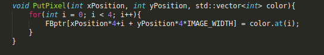
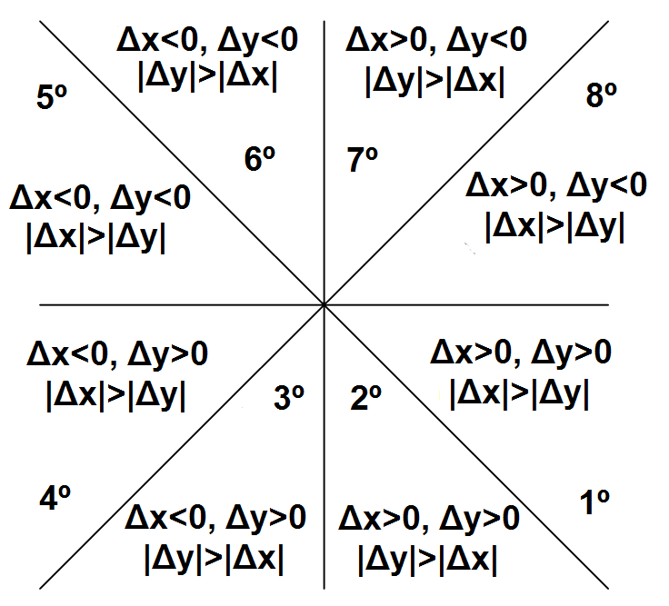
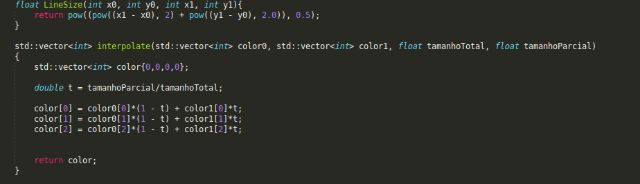
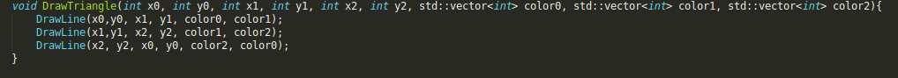
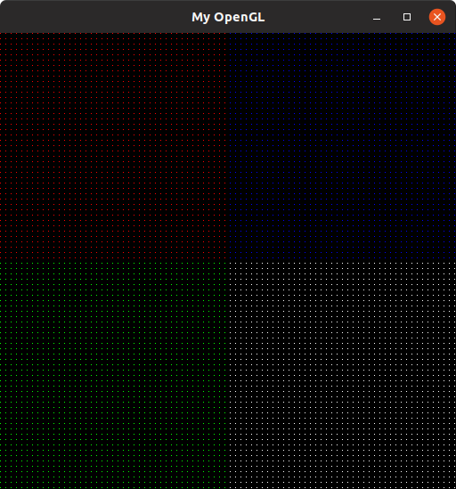
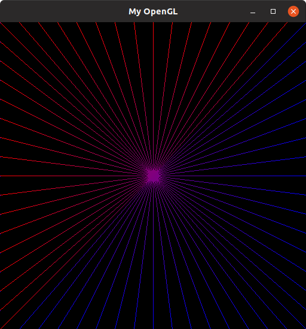
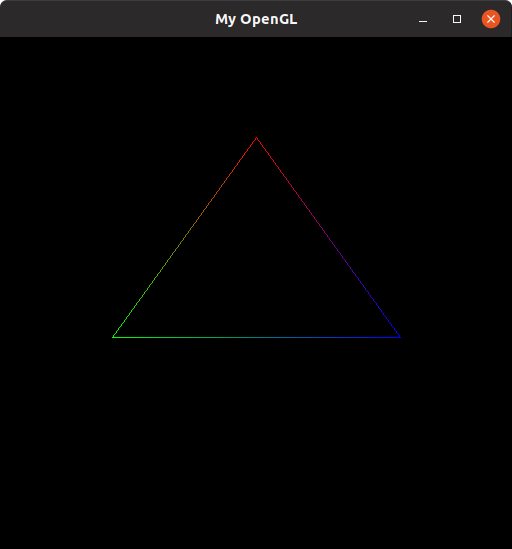

# Menu

* [Atividade 1](#bresenham)
* [Atividade 2](#desenvolvimento)

### Grupo
Lucas Fernandes Lucena 2016023725

Karina Alves Torreão Villarim 2016024660

---
## Bresenham
### Introdução
A primeira atividade da disciplina de computação gráfica tinha como principal objetivo a implementação do algorimo de Bresenham, este por sua vez traz uma forma de solucionar o problema de desenhar uma reta em uma tela pixelada. A tarefa ainda propõe a criação de uma função para pintar um pixel na tela, o desenho de uma reta e o desenho de um triangulo. Além disso, pede-se que ocorra a interpolação linear das cores durante a formação de retas.

---

### Desenvolvimento
Antes de qualquer coisa, o essencial para o desenhdo de qualquer coisa é o posicionamento de um pixel na tela e que ele seja colorido com uma cor previamente determinada. Com os slides apresentados em sala foi possível implementar tal função.

	 
	
	<h5 align="center">Figura 1 - PutPixel()</h5>
	 

Já em relação ao desenho de retas através da implementação do algoritmo de Bresenham, o código apresentado em sala aula apenas solucionava o problema quando a linha era desenhada de cima para baixo e quando o Δx era maior que o Δy, nos 1º, 2º, 5º e 6º octantes. Com essa informação, transformamos todas as entradas possíveis para o caso que apresenta uma solução com o código dado. Sendo assim, é necessário inverter os valores de x0 e x1 bem como y0 e y1 quando o trajeto da reta é de baixo para cima, também sendo necessário inverter as coordenadas x, y, como também os seus respectivos deltas quando o y crescer mais que o x no desenho da reta, isto é, quando o Δy for miaor que o Δx.

	 
	
	<h5 align="center">Figura 2 - Octantes</h5>
	 

Entretanto, mesmo após esses tratamentos, os 3º, 4º, 7º e 8º octantes ainda permaneciam sem solução, pois  um caso especial em que quando a coordenada x aumenta a y diminui e vice e versa. Então foi criado mais um if de tratamento em que quando o Δx multiplicado pelo Δy fosse negativo significa que a reta estava em um desses octantes. 

A interpolação linear das cores foi solucionada com uma simples lógica matemática em que a posição atual da reta é dividida pelo tamanho total gerando assim números de 0 a 1 chamado no código de "t"  e esse número é multiplicado pela cor final e (1-t) é multiplicado pela cor inicial. Dessa forma, ocorre a transição da cor inicial para a final. 

	 
	
	<h5 align="center">Figura 3 - Interpolate()</h5>
	 

A última etapa da tarefa era o desenho de o um triângulo que é só chamar a função de desenhar linha três vezes.

	 
	
	<h5 align="center">Figura 4 - DrawTriangle()</h5>
	 

---

### Resultados
Após a compreensão tanto do problema quanto do código ficou mais tranquila a resolução da tarefa. Com o famoso de divisão e conquista, o problema se apresentou em problemas menores e mais fáceis. A maior dificuldade foi entender o algoritmo de Bresenham em si e assim criar várias estruturas condicionas para que a entrada fosse polída e pudesse se encaixar neste algoritmo. Acreditamos que o código poderia se apresentar de forma mais enxuta com menos if visto que qualquer redução de código feita será bem vista.

	 
	
	<h5 align="center">Figura 5 - Pontos</h5>
	 

	 
	
	<h5 align="center">Figura 6 - Retas</h5>
	 

	 
	
	<h5 align="center">Figura 7 - Triangulo</h5>
	 

---

### Referências

https://rosettacode.org/wiki/Bitmap/Bresenham%27s_line_algorithm

https://en.wikipedia.org/wiki/Rasterisation
